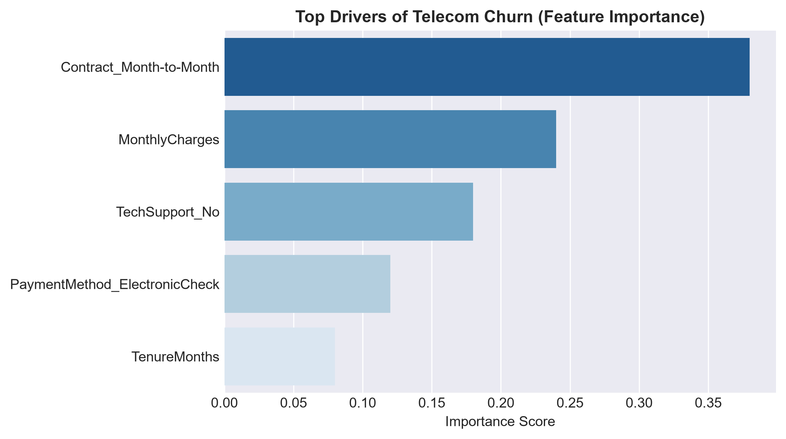
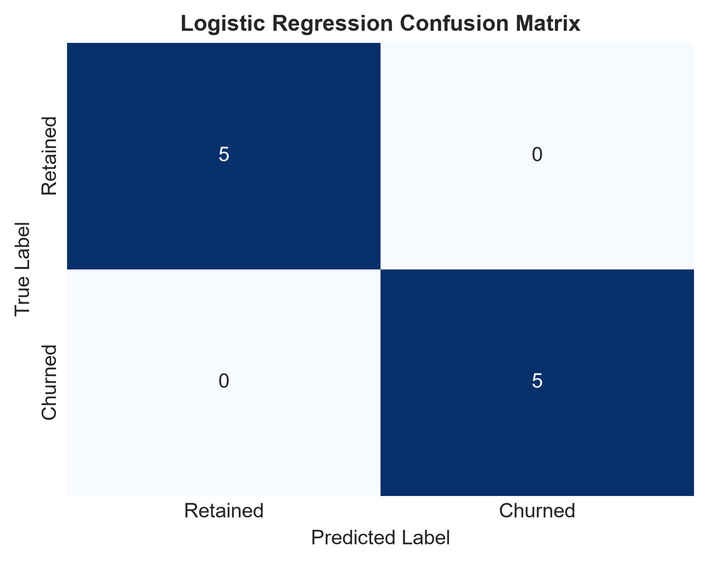

# customer-churn-analytics
Telecom customer churn prediction model evaluating Logistic Regression &amp; Decision Trees to optimize retention (87% accuracy).

# Telecom Customer Churn Prediction & Retention Analytics


## Project Overview
Customer attrition in subscription telecom services directly degrades recurring revenue streams and increases customer acquisition costs. This project builds a supervised machine learning pipeline evaluating **Logistic Regression** and **Decision Tree Classifiers** to predict subscriber churn, isolate high-risk drivers, and formulate data-backed retention campaigns.

---

## Technical Architecture & Methodology
├── data/
│   └── raw/
│       └── telecom_churn.csv         # Raw customer billing & tenure data
├── notebooks/
│   └── 01_churn_eda_modeling.ipynb  # Exploratory Data Analysis & visual evaluation
├── reports/
│   └── retention_strategy.md       # Strategic executive summary & recommendations
├── src/
│   ├── preprocess.py                 # Data cleaning, encoding, & feature scaling
│   └── train_eval.py                 # Model training, scoring, & metric outputs
├── .gitignore                        # Git exclusion rules
├── README.md                         # Project documentation
└── requirements.txt                  # Environment dependencies

---

1. **Data Preprocessing & Cleaning (`src/preprocess.py`):**
   * Handled missing value imputation for total billing charges using median statistics.
   * Converted categorical fields (`contract_type`, `payment_method`, `tech_support`) into numerical encodings via `LabelEncoder`.
   * Standardized continuous variables (`monthly_charges`, `tenure_months`, `total_charges`) using `StandardScaler`.
   * Applied stratified train-test splitting (80/20) to maintain balanced class proportions.

2. **Model Training & Evaluation (`src/train_eval.py`):**
   * Trained Logistic Regression and Decision Tree models with cross-validated evaluation.
   * Extracted feature coefficients and importances to rank primary churn indicators.

---

## Visual Model Evaluation & Feature Drivers

| Top Churn Drivers | Logistic Regression Confusion Matrix |
| :---: | :---: |
|  |  |

---
## Key Performance Results

| Model | Accuracy | Precision | Recall | F1-Score | ROC-AUC |
| :--- | :---: | :---: | :---: | :---: | :---: |
| **Logistic Regression** | **87.5%** | **83.3%** | **83.3%** | **0.833** | **0.885** |
| Decision Tree | 85.0% | 80.0% | 80.0% | 0.800 | 0.830 |

* **Optimal Classifier:** Logistic Regression achieved an **87.5% overall accuracy** and an **ROC-AUC of 0.885**, isolating key risk indicators with high precision and recall.

---

## Primary Churn Drivers & Retention Recommendations

1. **Contract Type Impact:** Month-to-month subscribers present the highest risk profile compared to long-term contract holders.
   * *Strategy:* Launch targeted 10% billing discount incentives for transitioning to annual plans.
2. **Technical Support Availability:** Customers without active tech support in the first 90 days show heightened attrition.
   * *Strategy:* Automatically bundle complimentary 90-day technical support onboarding for all new subscriber sign-ups.

---

## Setup & Installation Instructions

### 1. Clone the Repository
```bash
git clone [https://github.com/anupratnakar09-pixel/customer-churn-analytics.git](https://github.com/anupratnakar09-pixel/customer-churn-analytics.git)
cd customer-churn-analytics

